<div align="center">

<!-- Replace with your logo when available -->


# 🛡️ SocQuery Lab

### Browser-Based SOC Investigation & SIEM Query Training Platform

**Search. Detect. Investigate. Learn.**

[🌐 Launch Live Application](https://socquery-lab.vercel.app/)

</div>

---

## 🎯 Overview

**SocQuery Lab** is a browser-based cybersecurity learning and SIEM investigation training platform designed to help aspiring and practicing security analysts develop practical skills through realistic SOC workflows.

The platform provides a hands-on environment for:

* 🔍 Searching security telemetry
* 🧠 Analyzing suspicious activity
* 🔗 Correlating security events
* 🛡️ Building detections
* 🚨 Triaging alerts
* 🔎 Investigating incidents
* 🎯 Learning MITRE ATT&CK concepts

Instead of focusing only on cybersecurity theory, SocQuery Lab allows users to practice how security analysts work with telemetry and investigations in a realistic training environment.

> 🌐 **Live Application:** [Launch SocQuery Lab](https://socquery-lab.vercel.app/)

---

# 🚀 Why SocQuery Lab?

Cybersecurity education often focuses heavily on theory.

However, working in a Security Operations Center requires practical skills.

Security analysts need to know how to:

* Search large volumes of security events
* Identify suspicious behavior
* Correlate activity across multiple telemetry sources
* Write detection logic
* Investigate alerts
* Pivot between users, hosts, and IP addresses
* Understand attacker techniques

SocQuery Lab was built to help bridge the gap between:

```text
Cybersecurity Theory
        ↓
Hands-On Investigation
        ↓
Real SOC Skills
```

The platform provides a complete browser-based environment for practicing security investigation workflows without requiring a complex SIEM infrastructure.

---

# 🧠 The SOC Investigation Lifecycle

SocQuery Lab brings multiple stages of a typical SOC workflow into one environment.

```text
Security Telemetry
        │
        ▼
🔍 Search & Query
        │
        ▼
🧠 Analyze & Correlate
        │
        ▼
🛡️ Detection Engineering
        │
        ▼
🚨 Alert Generation
        │
        ▼
🔎 Investigation & Pivoting
        │
        ▼
📝 Triage & Resolution
```

---

# ✨ Platform Capabilities

## 🔍 SIEM Search & Reporting

Search and investigate realistic security telemetry using an original query engine designed for educational SOC training.

Users can:

* Search security events
* Filter suspicious activity
* Aggregate data
* Analyze event distributions
* Extract fields
* Sort results
* Correlate events
* Perform time-based analysis

📖 [Learn more about the query language](docs/query-language.md)

---

## 🧩 Explain Query

SocQuery Lab includes an educational **Explain Query** capability.

Complex queries are broken down step-by-step to help users understand:

1. What each pipeline command does
2. How events are transformed
3. How data changes between stages
4. How the final result is produced

This feature helps beginners move from simply copying queries to understanding how security queries actually work.

---

## 📊 Executive SOC Dashboard

The dashboard provides a high-level view of security activity.

It includes:

* Security KPIs
* Event distribution charts
* Telemetry insights
* MITRE ATT&CK tactic coverage
* Security activity summaries

Every visualization is designed to provide context about the underlying data and investigation perspective.

---

## 🛡️ Detection Engineering

Users can transform security queries into detection rules.

Detection rules can include:

* Detection name
* Query logic
* Severity
* Thresholds
* MITRE ATT&CK mapping
* Detection status

📖 [Detection Workflow Documentation](docs/detection-workflow.md)

---

## 🚨 Alert Triage

SocQuery Lab simulates the lifecycle of a SOC alert.

Supported investigation statuses include:

* 🆕 New
* 🔍 Investigating
* ⚠️ False Positive
* ✅ Resolved

Analysts can review alerts, investigate related events, add notes, and track the investigation lifecycle.

---

## 🔎 Incident Investigation

The investigation workflow allows users to:

* Inspect raw security events
* Analyze event details
* Pivot on source IP addresses
* Pivot on users
* Explore related activity
* Follow chronological event timelines

📖 [Investigation Workflow Documentation](docs/investigation-workflow.md)

---

## 📥 Local Data Ingestion

Users can upload their own logs for practice.

Supported formats include:

* CSV
* JSON
* JSONL
* TXT

The platform supports isolated practice sessions, allowing users to work exclusively with a selected dataset.

---

## 🧪 SOC Challenges

SocQuery Lab includes progressive cybersecurity challenges designed to develop investigation skills.

Challenges are organized into:

🟢 Beginner
🟡 Intermediate
🔴 Advanced

Each challenge can include:

* Investigation objectives
* Progressive hints
* Query-based exercises
* Automated validation

📖 [Explore Challenge Design](docs/challenges.md)

---

## 🗺️ MITRE ATT&CK Learning

The platform maps relevant detections and training scenarios to MITRE ATT&CK concepts.

This helps users connect:

```text
Security Event
      ↓
Suspicious Behavior
      ↓
Detection Logic
      ↓
MITRE ATT&CK
```

---

# 📸 Platform Preview

## 📊 Executive SOC Dashboard

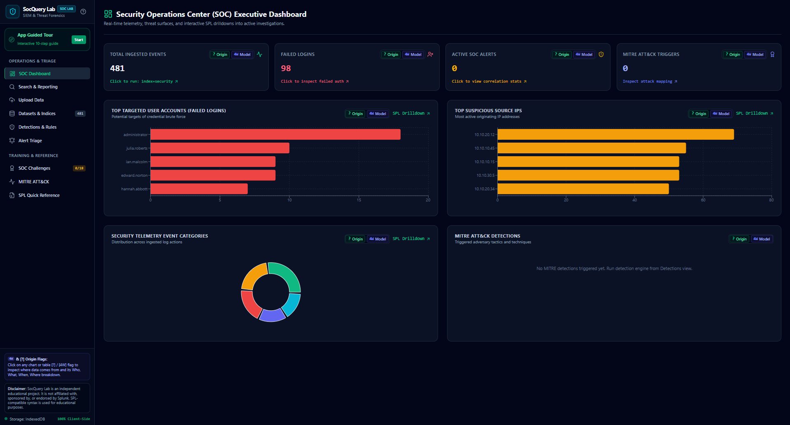

---

## 🔍 Search & Reporting Console

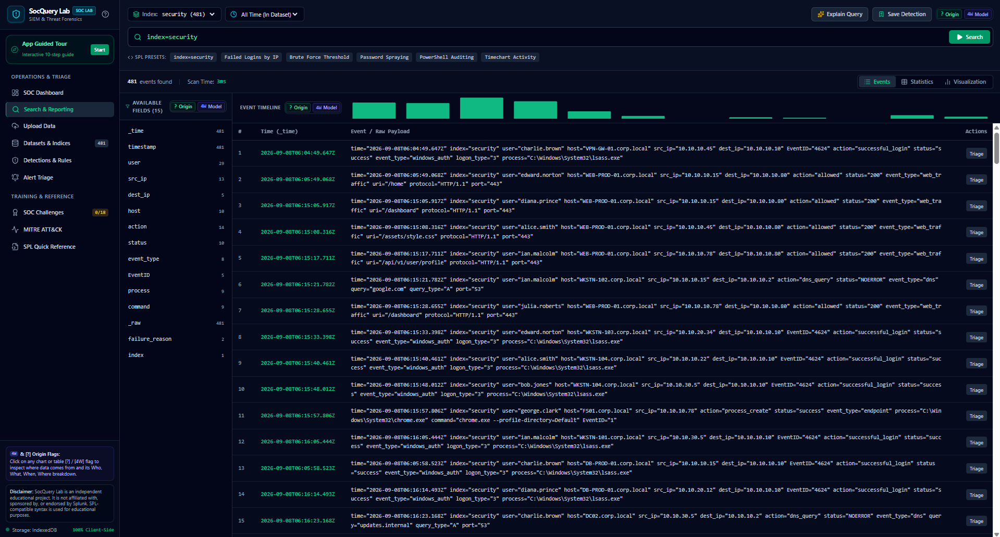

---

## 📋 Query Results

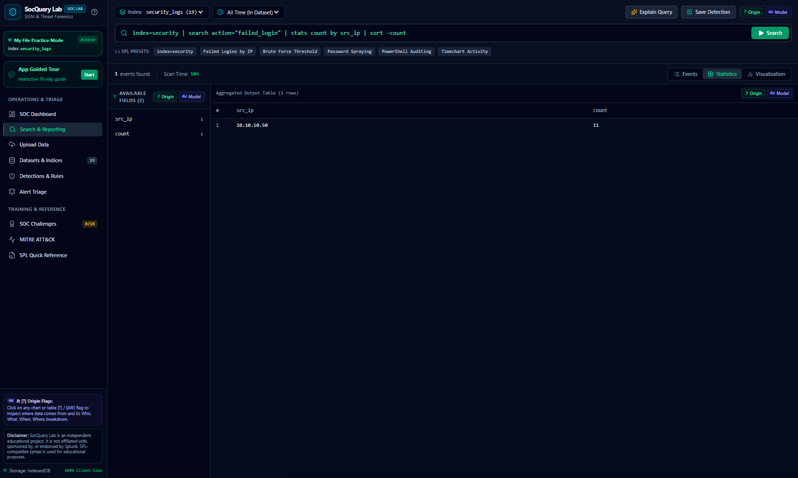

---

## 🧠 Explain Query

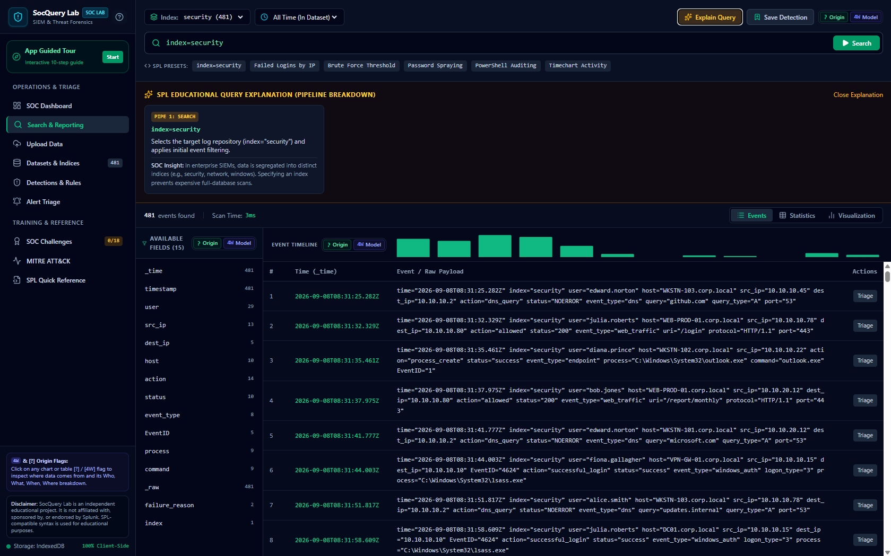

---

## 🛡️ Detection Engineering

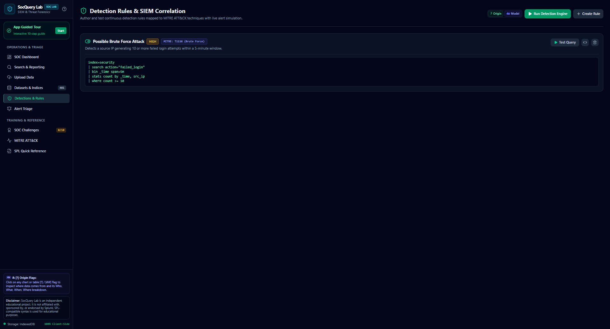

---

## 🚨 Alert Queue

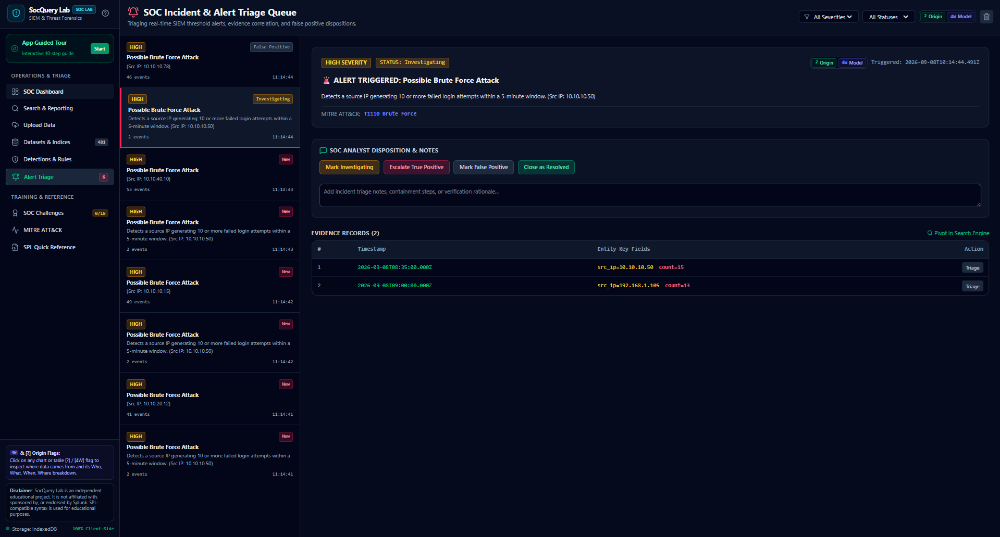

---

## 🔎 Incident Investigation

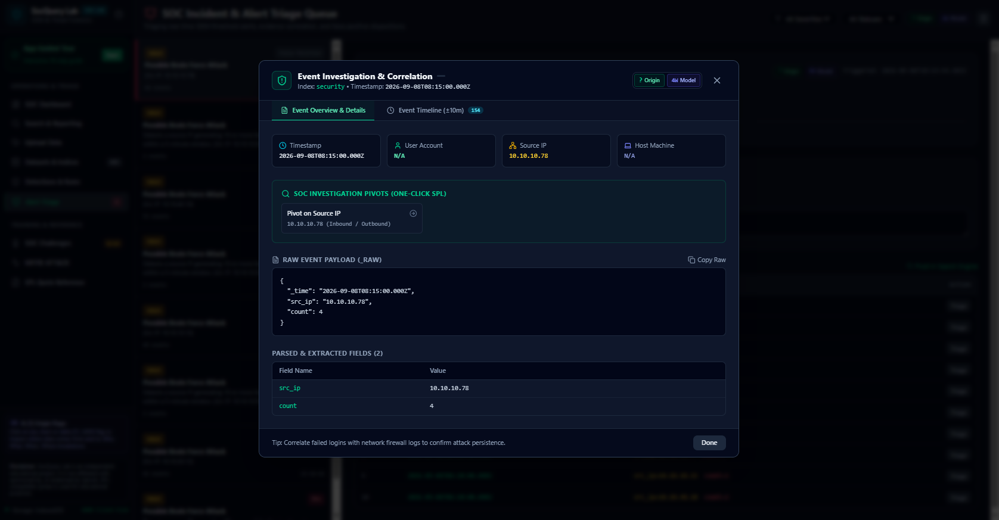

---

## ⏱️ Event Timeline

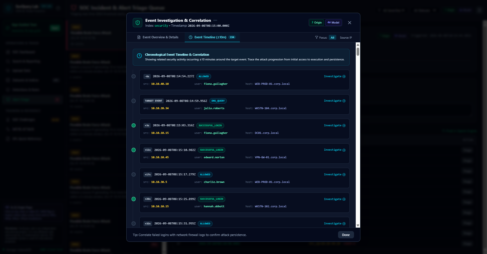

---

## 📥 Data Upload

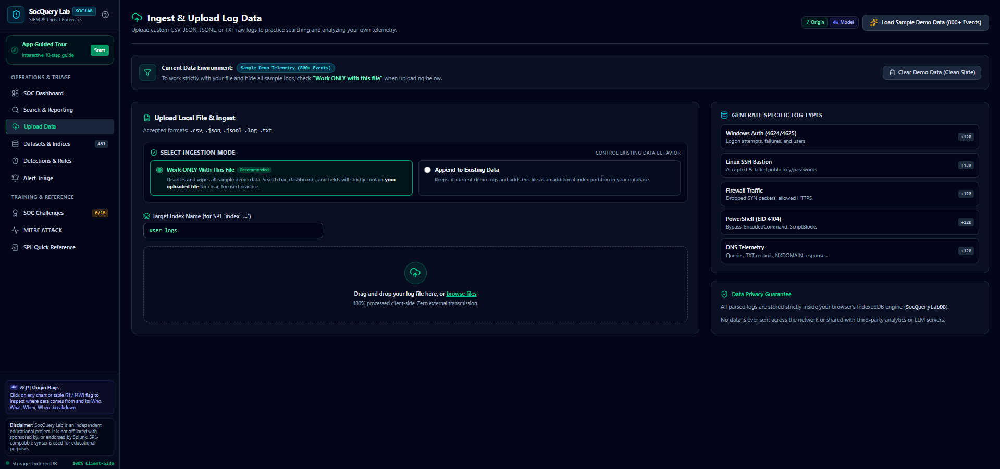

---

## 🗂️ Dataset Management

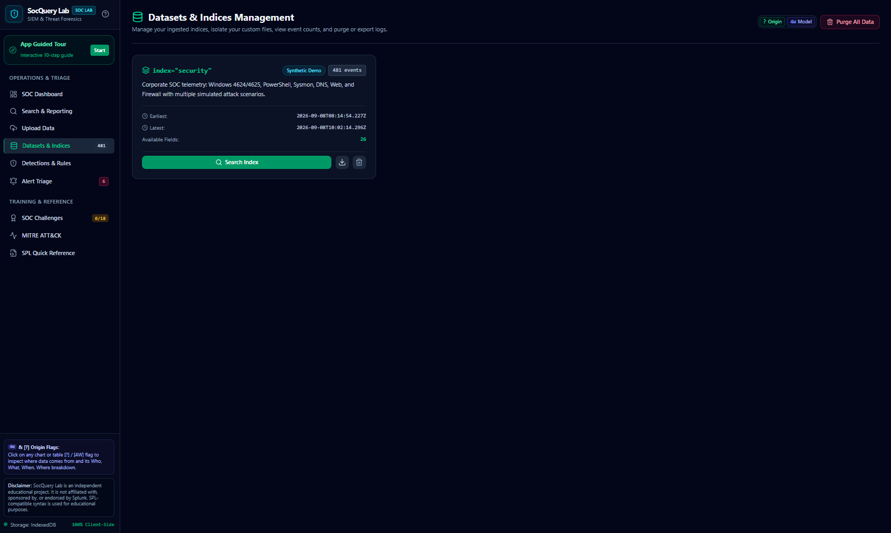

---

## 🧪 SOC Challenges

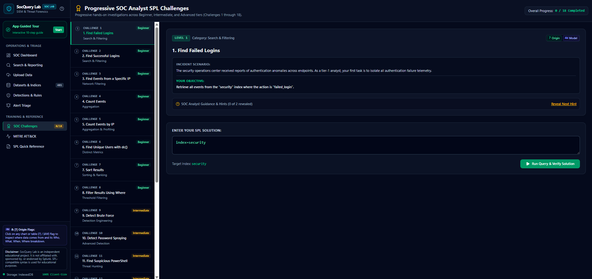

---

## 🗺️ MITRE ATT&CK Matrix

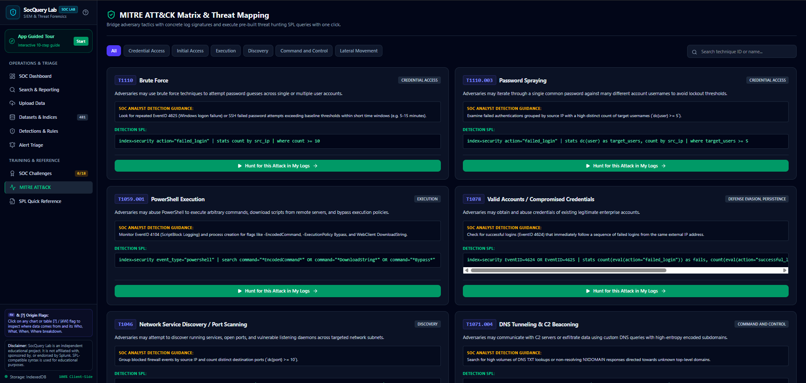

---

# 🏗️ Technical Architecture

SocQuery Lab is designed as a privacy-first browser application.

```text
┌─────────────────────────────────────────────┐
│                  Browser                    │
│                                             │
│              SocQuery Lab                   │
│                                             │
├─────────────────────────────────────────────┤
│                                             │
│        React + TypeScript Application       │
│                                             │
│   Dashboard • Search • Detections • Alerts  │
│   Investigation • Challenges • MITRE        │
│                                             │
├─────────────────────────────────────────────┤
│                                             │
│       Original Query Processing Engine      │
│                                             │
│   Search → Transform → Aggregate → Analyze  │
│                                             │
├─────────────────────────────────────────────┤
│                                             │
│                 IndexedDB                   │
│                                             │
│               SocQueryLabDB                 │
│                                             │
└─────────────────────────────────────────────┘
```

📖 [Read the full architecture documentation](docs/architecture.md)

---

# 🔐 Privacy-First Architecture

SocQuery Lab is designed around local browser processing.

```text
User Logs
    │
    ▼
Browser
    │
    ▼
Local Parsing
    │
    ▼
Local Indexing
    │
    ▼
Local Query Execution
    │
    ▼
IndexedDB
```

The platform is designed so that user-uploaded telemetry can be processed locally within the browser.

📖 [Read the Privacy Architecture](docs/privacy.md)

---

# 🛠️ Technology Stack

| Category      | Technology   |
| ------------- | ------------ |
| Frontend      | React        |
| Language      | TypeScript   |
| Build Tool    | Vite         |
| Styling       | Tailwind CSS |
| Icons         | lucide-react |
| Animation     | motion/react |
| Visualization | Recharts     |
| Local Storage | IndexedDB    |

---

# 🎓 Skills Demonstrated

SocQuery Lab demonstrates practical knowledge across cybersecurity and software engineering.

### Cybersecurity

* Security Operations Center workflows
* SIEM investigation
* Security telemetry analysis
* Threat detection
* Detection engineering
* Alert triage
* Incident investigation
* Event correlation
* MITRE ATT&CK concepts
* Windows security events
* Linux authentication logs
* DNS analysis
* PowerShell investigation

### Software Engineering

* React architecture
* TypeScript
* Browser-based data processing
* IndexedDB
* Query parsing
* Data transformation pipelines
* Data visualization
* Modular application design
* Privacy-first architecture

---

# 📚 Documentation

| Document                                                 | Description                                |
| -------------------------------------------------------- | ------------------------------------------ |
| [Architecture](docs/architecture.md)                     | Platform architecture and technical design |
| [Features](docs/features.md)                             | Complete platform capabilities             |
| [Privacy](docs/privacy.md)                               | Client-side data processing model          |
| [Query Language](docs/query-language.md)                 | Educational SPL-compatible syntax          |
| [Detection Workflow](docs/detection-workflow.md)         | Detection engineering lifecycle            |
| [Investigation Workflow](docs/investigation-workflow.md) | SOC investigation methodology              |
| [Challenges](docs/challenges.md)                         | Progressive learning system                |

---

# ⚠️ Disclaimer

SocQuery Lab is an independent educational cybersecurity platform.

It is not affiliated with, sponsored by, or endorsed by Splunk.

The platform uses an original, custom-built query engine supporting an educational subset of SPL-compatible syntax.

All trademarks and product names belong to their respective owners.

---

# 🔒 Source Code & Project Access

SocQuery Lab is publicly available as a live application for demonstration and educational use.

The production source code is currently maintained privately.

This repository serves as the official public showcase and documentation hub for the project.

It provides:

* Product documentation
* Architecture overview
* Feature demonstrations
* Platform screenshots
* Technical design information
* Privacy principles

🌐 **Try the platform:** [Launch SocQuery Lab](https://socquery-lab.vercel.app/)

---

# 🚀 Project Vision

The long-term goal of SocQuery Lab is to provide an accessible environment where cybersecurity learners can develop practical SOC investigation skills by learning through realistic scenarios.

Future areas of exploration may include:

* Additional telemetry sources
* More attack scenarios
* Advanced investigation exercises
* Detection templates
* Investigation playbooks
* Expanded MITRE ATT&CK coverage
* Additional visualization capabilities
* Collaborative learning features

---

# 👨‍💻 Author

**Souhail Bakioui**

Cybersecurity Enthusiast | SOC Analyst Aspirant | Full-Stack Developer

Interested in:

* 🛡️ Cybersecurity
* 🔍 SOC Operations
* 🚨 Detection Engineering
* 💻 Security Automation
* ☁️ Cloud & DevSecOps

---

<div align="center">

# 🛡️ Learn. Query. Detect. Investigate.

### SocQuery Lab

**Practical SOC Investigation Training — Directly in Your Browser**

[🌐 Launch the Live Application](https://socquery-lab.vercel.app/)

</div>
